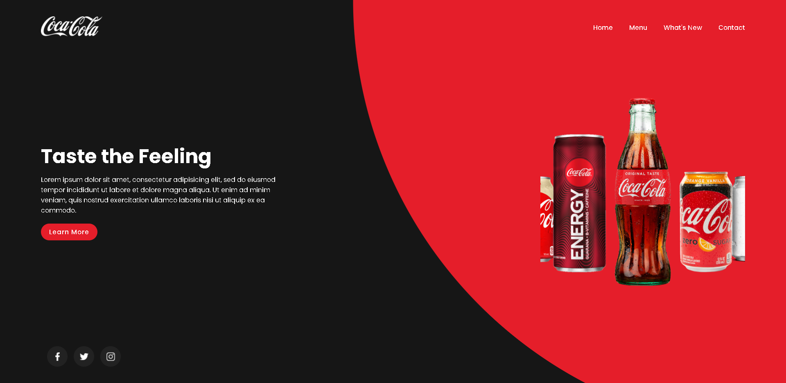

# Cocacola-Template

<h3>Responsive Website Design using Html CSS &amp; JS</h3>

<menu>
  <li>A Practice Design Template, Mainly Focused on practical Javascript.</li>
  <li>Used Swiper.js lib</li>
</menu>

# JavaScript Practice Template

<pre>
1st Day: 9/2/2022
first Dev session:      07:20 AM    ~   09:10 AM        ~ 01h 50m

</pre>

<pre><q>Challenge Completed in   01h 50m</q></pre>

 
 
 

# Original Desgin: Online Tutorials YT

 
 
 
🍬 Leave a :star:&nbsp;if you like it, Please!🤩

 

📫 Please hit me up at mohammed.yuossry@gmail.com if you have any feedback or improvements.
